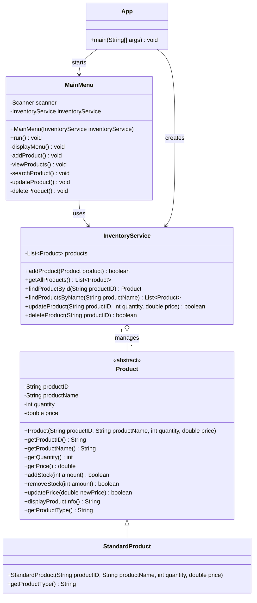

# Inventory Manager Class Diagram

This diagram shows the current class structure of the Inventory Manager
application. It will be updated as additional product types, interfaces,
and persistence classes are added.

## Relationship Summary

- `App` creates the `InventoryService` and starts the `MainMenu`.
- `MainMenu` handles user interaction and sends inventory requests to
  `InventoryService`.
- `InventoryService` manages a collection of `Product` objects.
- `Product` is an abstract parent class containing information and behavior
  shared by all product types.
- `StandardProduct` inherits from `Product` and represents a regular
  inventory item.

## Planned Updates

This diagram will be updated after adding:

- `PerishableProduct`
- An interface for advanced product behavior
- `InventoryRepository`
- File-saving and loading relationships