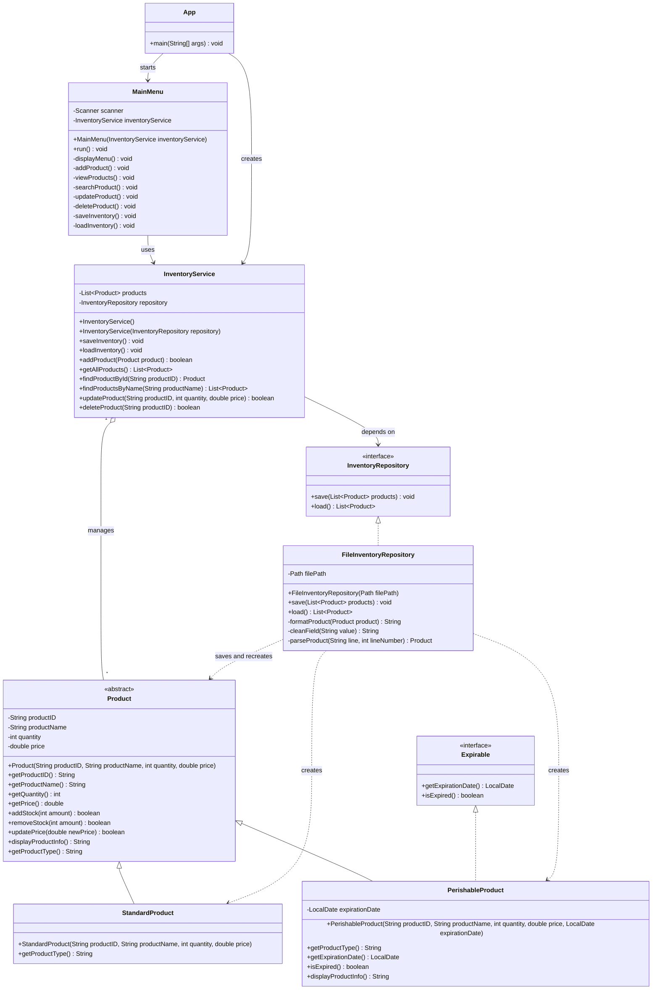

# Inventory Manager Class Diagram

This diagram shows the current class structure of the Inventory Manager
application. The application separates product models, user interaction,
business logic, and file persistence.

## Relationship Summary

- `App` creates the `InventoryService`, supplies it to `MainMenu`, and starts
  the application.
- `MainMenu` handles console input and output and delegates inventory
  operations to `InventoryService`.
- `InventoryService` manages the in-memory collection of `Product` objects.
- `InventoryService` depends on the `InventoryRepository` interface rather
  than a specific storage implementation.
- `InventoryRepository` defines the required save and load operations.
- `FileInventoryRepository` implements the repository interface using a
  tab-separated text file.
- `Product` is the abstract parent class for all inventory products.
- `StandardProduct` represents a regular inventory item.
- `PerishableProduct` extends `Product` and implements `Expirable`.
- `Expirable` defines the behavior required for objects with expiration dates.